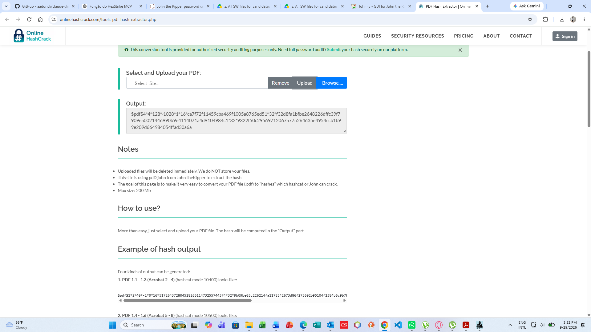
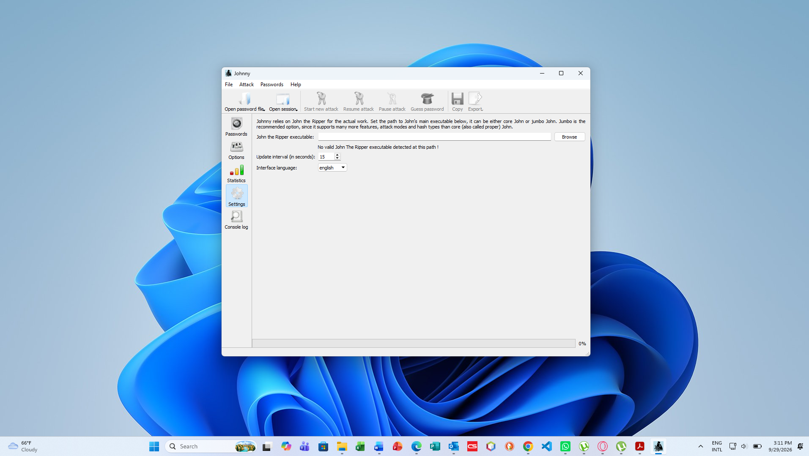
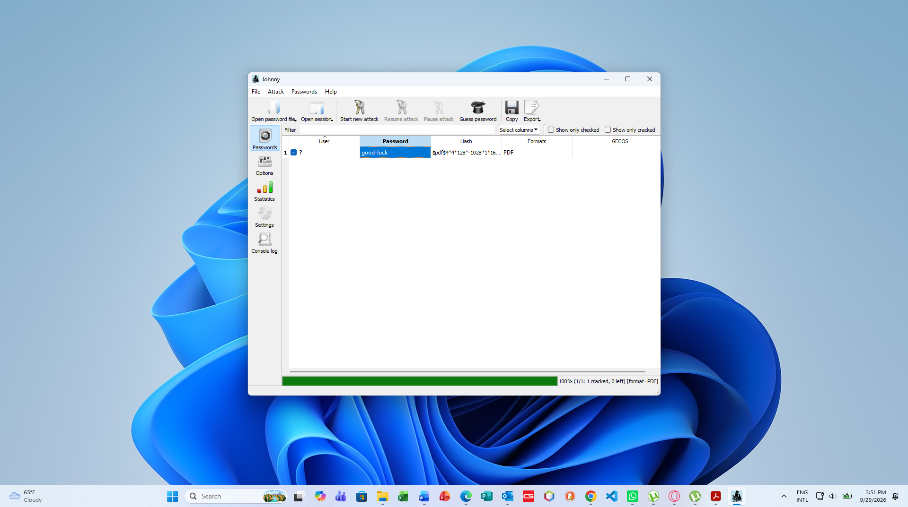
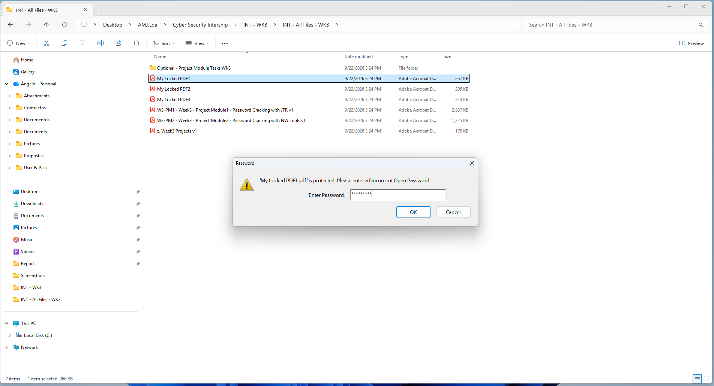
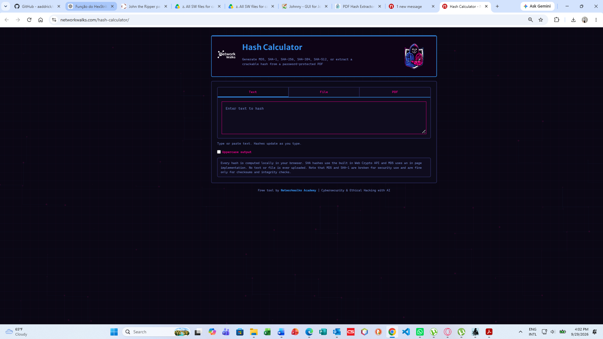
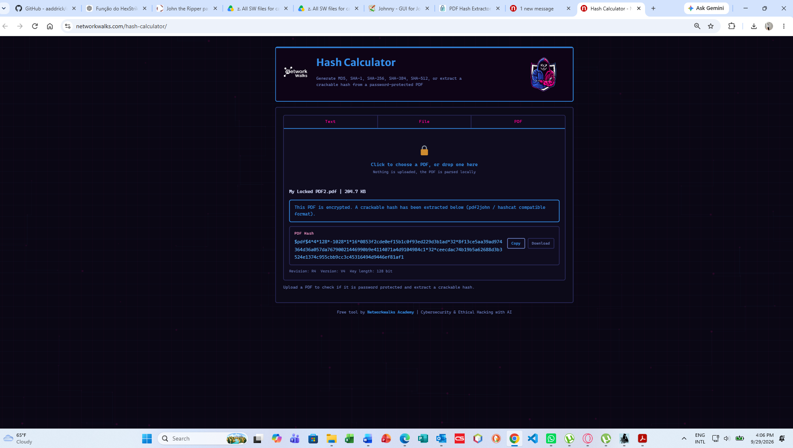
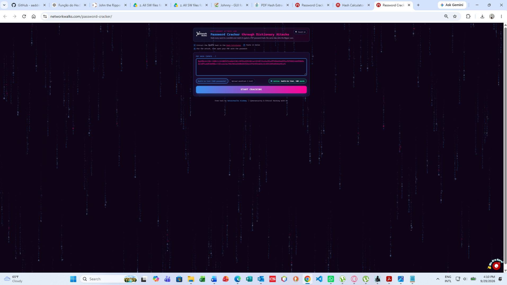
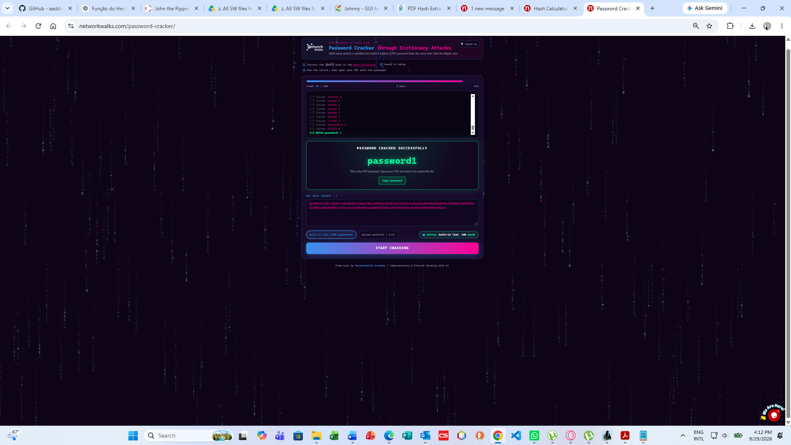

# 🔐 Week 3 — Password Cracking & Dictionary Attacks

## 📋 Project Overview

**Week 3** of the NetworkWalks Cybersecurity Program focuses on **Phase 3 of the Ethical Hacking Lifecycle: Gaining Access** through controlled password-cracking and dictionary-attack techniques.

The project involved extracting cryptographic hashes from password-protected PDF documents and performing controlled password-recovery attacks using **John the Ripper (JtR)**, **Johnny GUI**, and **NetworkWalks Online Cracking Tools & Wordlist Generators**.

The exercises demonstrate practical skills in:

* 🔑 Password hash extraction and analysis
* 📚 Dictionary-based password attacks
* 🧬 Custom wordlist generation
* 🔄 Password mutation techniques
* 🛠️ John the Ripper (JtR) and Johnny GUI
* 🧪 Controlled password-recovery testing
* 📄 PDF password-protection analysis
* 📝 Technical documentation and reporting

> **⚠️ Disclaimer:** All activities documented in this project were performed in authorized laboratory/CTF environments for cybersecurity training and educational purposes.

---

## 📦 Project Modules & Status

| Module           | Module Name                               | Category  | Scope                                                                                   | Status        |
| ---------------- | ----------------------------------------- | --------- | --------------------------------------------------------------------------------------- | ------------- |
| **W3-PM1**       | Password Cracking with JtR                | Essential | Cracking authorized password-protected PDF targets using John the Ripper and Johnny GUI | ✅ Completed   |
| **W3-PM2**       | Password Cracking with NetworkWalks Tools | Essential | Hash analysis, dictionary attacks, and custom wordlist generation                       | ✅ Completed   |
| **W3-OPTIONAL1** | AI-Assisted JtR Lab                       | Optional  | Exploring AI-assisted workflows using Claude Desktop and HexStrike MCP                  | 📝 Documented |
| **W3-OPTIONAL2** | Mediroza Hospital Portal Lab              | Optional  | Authorized CTF-style credential attack simulation                                       | 📝 Documented |

---

# 🎯 Lab Targets & Results

The following authorized PDF targets were used to evaluate different password-cracking approaches.

| Target               | Format / Encryption   | Hash Type          | Attack Method                                 | Result             | Verification   |
| -------------------- | --------------------- | ------------------ | --------------------------------------------- | ------------------ | -------------- |
| `My Locked PDF1.pdf` | PDF 1.4 / 128-bit RC4 | `$pdf$4*4*128*...` | JtR Default Dictionary / NetworkWalks Cracker | Password recovered | ✅ PDF unlocked |
| `My Locked PDF2.pdf` | PDF 1.4 / 128-bit RC4 | `$pdf$4*4*128*...` | Custom Generated Wordlist                     | Password recovered | ✅ PDF unlocked |
| `My Locked PDF3.pdf` | PDF 1.4 / 128-bit RC4 | `$pdf$4*4*128*...` | Targeted 1,987-word list                      | Password recovered | ✅ PDF unlocked |

> 🔒 **Credential Note:** Recovered plaintext passwords are intentionally omitted from this public README. Evidence and passwords can be maintained in the private lab report or screenshots where appropriate.

---

# 🔓 W3-PM1 — Password Cracking with John the Ripper & Johnny GUI

## 🛠️ Tools Used

* **John the Ripper v1.9.0 Jumbo**
* **Johnny GUI v2.2**
* **Cygwin 64-bit**
* **x86_64 AVX2**
* PDF hash extraction tools
* Dictionary/wordlist files

  ## 🧪 Task 1: Cracking "My Locked PDF1"
Hash Extraction: Generated the $pdf$ hash string from My Locked PDF1.pdf and saved it to My Locked PDF1-Hash Value.txt.
Johnny Configuration: Loaded JTR engine path and imported the hash into Johnny.
Attack Execution: Launched dictionary attack - JTR cracked the hash in seconds.
Validation: Opened PDF with recovered password good-luck to reveal the secret flag.

Figure 2: Extracted hash saved locally as a .txt file for input into John the Ripper.

Figure 3: Hash loaded into Johnny, ready to begin the dictionary attack.

Figure 4: Johnny displaying the successfully cracked password good-luck for PDF1.

Figure 5: Entering the recovered password into the Adobe PDF password prompt.

# 🔧 W3-PM2: Password Cracking with NetworkWalks Tools
Platform: NetworkWalks Password Cracker Lab & Hash Calculator (networkwalks.com/password-cracker)

Task 1: Cracking PDF1 via NetworkWalks Online Tools
Hash Extraction: Uploaded My Locked PDF1.pdf to the NetworkWalks Hash Calculator to generate $pdf$ hash.
Initial Attempt: Pasted hash into the Online Password Cracker with standard 100-word list → returned ACCESS DENIED.
Wordlist Escalation: Switched to the comprehensive JTR_default_password.txt (3,556 words).
Result: Cracked successfully → password1.

Figure6: NetworkWalks Hash Calculator landing page with PDF tab selected.

Figure 7: Hash Calculator output showing crackable $pdf$ hash string.

Figure 8: Second attack in progress using the 3,556-word JTR dictionary.

Figure 9: Hash Calculator extracting $pdf$ hash for My Locked PDF3.

